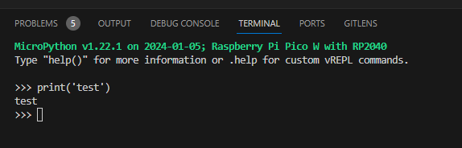
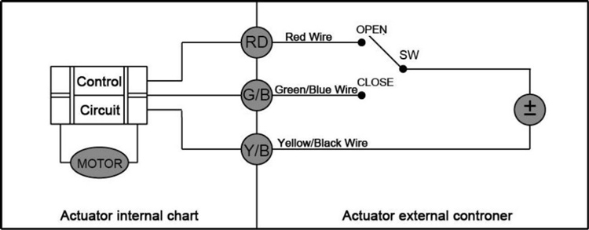

# auto-watering-system

## Firmware

### Important note

`firmware/src/configPrivate.py` is excluded from the repository due to security reasons. Provide your own version based on `configPrivateTemplate.py`

### Flashing MicroPython on RPI Pico W
- Go to [MicroPython download site](https://micropython.org/download/RPI_PICO_W/), and download the latest uf2. Alternatively, use `firmware/setup/RPI_PICO_W-[...].uf2`.
- While holding `BOOTSEL` button, connect RPI Pico W to the host. Copy the file to the USB mass storage device that appears. Reconnect the device.

### Erasing the whole FLASH
In case of a mess in the python filesystem, you can erase the whole FLASH and start with a clean image.
- Go to [Pico Nuke repository](https://github.com/polhenarejos/pico-nuke), and download latest release for RPI Pico W. Alternatively, use `firmware/setup/pico_nuke_pico_w-[...].uf2`.
- Flash the image as described above.
- When the USB storage reappears, flash the MicroPython image again.

### TODO describe

```bash
py -m venv .venv
source .venv/Scripts/activate
pip install mpremote
mpremote ls
find "firmware/src" -type f | xargs -I {} mpremote cp {} :
```

### Preparing VS Code
- Install MicroPico extension
- Run command (ctrl+shift+p): `MicroPico: Configure Project`
- Run command: `MicroPico: Connect`, or open new terminal: `Pico(W) vREPL`
- Code is executed on the RPI Pico machine.



### Flashing and running the code

1. Run command: `MicroPico: Connect`
2. For every non-main file, upload it directly: `MicroPico: Upload file to Pico`
3. For live session, while `main.py` is active: `MicroPico: Run current file on Pico`
File will be executed on interactive REPL. To stop, press `ctrl+c`
4. For permanent flash, upload `main.py` exactly like other files in step 2.

## TODO Temporary hardware notes

### RPI Pico 2 W pinout


### Parts used

1. Electrovalve: [CWX-25S](https://www.motorisevanne.com/product/electric-actuator-valve)


2. Power stage for the electrovalve
[IPD85P04P4](https://www.infineon.com/dgdl/Infineon-IPD85P04P4_07-DS-v01_00-en.pdf?fileId=db3a30432f69f146012f782666e92ddd), [BC817](https://www.diodes.com/assets/Datasheets/ds11107.pdf), smaj12ca?, 10k pullup, 1k base

3. Power stage for water/nutrients pumps
PMV20EN, 100uF tantalum, 4.7uF MLCC, B340 schottky, 10k pulldown